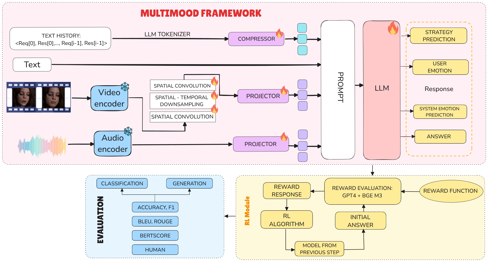

# 🧠 MultiMood Fine-tuning & Evaluation Guide


This repository supports multiple workflows for fine-tuning and evaluating video-language models. Please choose the appropriate branch based on your training or evaluation objective:



---

## 🔧 Fine-tuning Options

### 1. Supervised Fine-tuning
- **Branch:** [`feature/train_sft`](https://github.com/quangtuan-0504/Multimood/blob/feature/train_sft/)
- **Description:** Use this branch if you want to perform supervised fine-tuning on the video-language model. This method relies on labeled training data to guide the learning process.

### 2. Fine-tuning with GRPO (Gradient-based Reinforcement Preference Optimization)
- **Branch:** [`feature/GRPO`](https://github.com/quangtuan-0504/Multimood/blob/feature/GRPO/)
- **Description:** Use this branch to fine-tune the model using GRPO, a reinforcement learning technique that optimizes model behavior based on preference signals.

### 3. Fine-tuning with PPO (Proximal Policy Optimization)
- **Branch:** [`feature/PPO`](https://github.com/quangtuan-0504/Multimood/blob/feature/PPO/)
- **Description:** Use this branch for reinforcement learning via PPO. It is suitable for optimizing models based on reward functions when labeled data is limited or unavailable.

---

## 📊 Model Evaluation

### 4. Inference & Evaluation
- **Branch:** [`feature/inference_eval`](https://github.com/quangtuan-0504/Multimood/blob/feature/inference_eval)
- **Description:** Use this branch to evaluate the performance of your fine-tuned model. It includes inference scripts and evaluation metrics to benchmark model quality on various tasks.

---
## 📚 Citation
If you use this code or find our work helpful, please cite:
```bibitex
@inproceedings{Le2026Trustworthiness,
  title={Reinforce Trustworthiness in Multimodal Emotional Support System},
  author={Le, Huy M. and Nguyen, Dat Tien and Vo, Ngan T. T. and Nguyen, Tuan D. Q. and Binh, Nguyen Le and Nguyen,
  Duy Minh Ho and Sonntag, Daniel and Liao, Lizi and Nguyen, Binh T.},
  booktitle={Proceedings of the 40th Annual AAAI Conference on Artificial Intelligence (AAAI-26)},
  year={2026},
  pages={1--18},
  address={Singapore},
  url={https://ink.library.smu.edu.sg/sis_research/1075}
}
```
If you have any inquiries, please feel free to contact us by sending an [`email`](HuyM.Le@mbzuai.ac.ae).
---
### Acknowledge
- Special thanks to the **DAMO-NLP-SG Team**, whose work on the **VideoLLaMA** projects inspired this repository.
